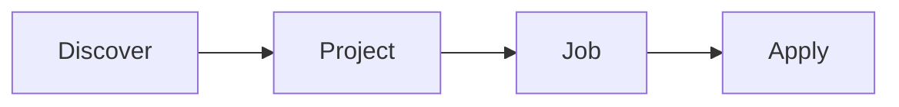
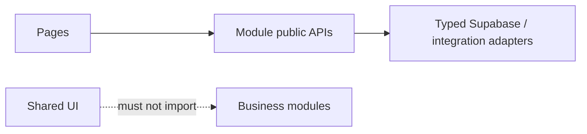
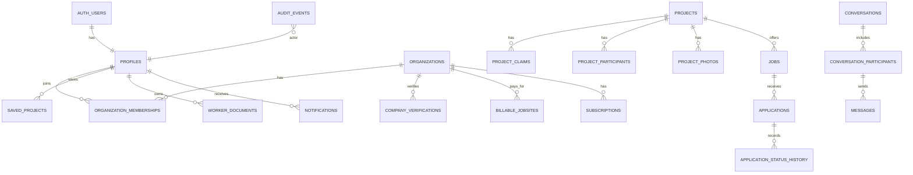
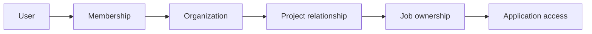

# Jobsite Finder V2 Complete System Architecture & Building Manual

> Source note: This Markdown file was converted from the official `Jobsite-Finder-V2-Complete-System-Architecture-and-Building-Manual.docx`, Version 1.0.0. The DOCX is the authoritative formatted source; this Markdown version is the Codex-readable primary architecture standard for future V2 missions.

| Document control | Approved value |
| --- | --- |
| Owner | Jobsite Finder Technologies Inc. |
| Founder & CEO | Joseph W. Smith |
| Architecture direction | Modernize V1 into V2 |
| Version | 1.0.0 — Approved building baseline |
| Status | Living controlled manual |
| Effective date | 7 August 2026 |

> **Core workflow — Discover → Project → Job → Apply**

## How to use this manual

This manual replaces the scattered multi-part approach. It combines the architecture baseline, authorization model, data design, module map, ER diagrams and implementation sequence into one document. The V1 code audit remains a separate supporting record.

| Audience | Use |
| --- | --- |
| Joseph / product owner | Approve scope, workflows, pricing and business rules. |
| Codex in VS Code | Implement one mission at a time and prove acceptance criteria before continuing. |
| Developers | Follow module boundaries, database rules, tests and change controls. |
| Security/privacy reviewers | Assess RLS, private data, evidence, retention and incident controls. |

### Rules of authority

- The manual defines the intended V2 design; the repository and Supabase schema prove the current implementation.
- If code conflicts with this manual, stop and create an architecture decision before changing production behavior.
- Every database change uses a reviewed migration, rollback plan and tests. No direct production editing.
- Security-critical fixes may begin after the related rule in this manual is approved; the whole manual need not be “finished forever.”
### Document status and revision control

| Version | Date | Change | Status |
| --- | --- | --- | --- |
| 1.0.0 | 2026-08-07 | Combined V1 audit decisions, Parts 1–2 and master V2 map. | Approved baseline |

## Table of contents

- 1. Product and architecture baseline
- 2. Complete website and navigation map
- 3. Modular application architecture
- 4. Users, organizations and permissions
- 5. Supabase data architecture and ER diagrams
- 6. Core workflows: Discover → Project → Job → Apply
- 7. Messaging and notifications
- 8. Billing and Stripe
- 9. Administration, analytics and audit
- 10. Privacy, security and compliance
- 11. Testing, environments and deployment
- 12. V1-to-V2 migration and build order
- 13. Module completion checklists
- Appendix A. Architecture decisions
- Appendix B. Database table catalogue
- Appendix C. Codex mission template
## 1. Product and architecture baseline

### 1.1 Product purpose

Jobsite Finder is a project-centred construction workforce platform. It connects skilled trades workers, general contractors and subcontractors through real active construction projects across Canada, with U.S. readiness built into the design.

> **MVP promise — Workers discover real projects, open a project, find a job and apply. Contractors manage only their own company, projects, jobs and applicants.**

### 1.2 Locked architecture decision

| Layer | V2 standard | Decision |
| --- | --- | --- |
| Frontend | React + Vite + TypeScript | Keep and reorganize V1. |
| Backend and database | Supabase | Locked foundation; no OpenSaaS/Prisma migration. |
| Database engine | Supabase-managed PostgreSQL | One verified schema and migration history. |
| Authentication | Supabase Auth | Server-verified identity. |
| Authorization | RLS + protected server functions | Deny by default; frontend is not security. |
| File storage | Supabase Storage | Private sensitive buckets; signed access. |
| Hosting | Vercel | Separate preview, staging and production. |
| Maps | MapLibre-compatible map stack | Adapter isolates tile/geocoding provider. |
| Payments | Stripe | Hosted checkout/portal; webhook authority. |

### 1.3 Architectural shape

V2 is a modular monolith: one deployable web application and one Supabase backend, divided into strict business modules. This is simpler than microservices while still supporting growth.

| Client experience | Application modules | Supabase foundation |
| --- | --- | --- |
| Public site, dashboards, map, project pages, forms | Auth, organizations, projects, discovery, hiring, communications, billing, admin | PostgreSQL, Auth, RLS, Storage, Edge Functions, Realtime only where justified |

### 1.4 Launch scope and non-goals

| Build for beta | Defer until validated |
| --- | --- |
| Accounts, profiles, organizations, team roles, map, projects, claims, SC participation, jobs, applications, hiring pipeline, basic notifications, billing, admin, privacy controls | Native mobile apps, AI matching/scoring, advanced enterprise SSO, microservices, public APIs, complex ad marketplace, blockchain, multi-region active-active infrastructure |

## 2. Complete website and navigation map

| Area | Pages / screens | Primary users |
| --- | --- | --- |
| Public | Home; How It Works; Map/Projects; Project Detail; Pricing; About; Contact; Privacy; Terms; Sign In; Sign Up | Everyone |
| Worker | Dashboard; Profile; Résumé/Documents; Discover Map; Saved Projects; Jobs; Applications; Messages; Notifications; Settings | Worker |
| Company | Dashboard; Company Profile; Team; Projects; Claims/Participation; Jobs; Applicants; Hiring Pipeline; Messages; Billing; Settings | GC/SC members |
| Admin | Overview; Users; Organizations; Verifications; Projects; Claims; Reports; Moderation; Support; Billing status; Audit Events; System Health | Authorized platform admins |

### 2.1 Navigation rules

- Public visitors can explore published project information without seeing private worker or contractor data.
- After login, navigation is determined by active context: worker workspace or selected organization.
- A person may have one personal account and memberships in multiple organizations; organization switching never changes platform identity.
- Mobile navigation must expose the same essential actions as desktop.
### 2.2 Project lifecycle visibility

| State | Public map | Project page | Hiring |
| --- | --- | --- | --- |
| Draft | No | Authorized organization/admin only | No |
| Upcoming | Yes when publishable | Yes | Optional |
| Active | Yes | Yes | Yes |
| On hold | Normally hidden or clearly marked | Controlled | No new hiring by default |
| Completed | Archive/search only by policy | Read-only | Closed |
| Cancelled | Hidden from discovery | Admin/owner record | Closed |

### 2.3 Primary user journeys

| Journey | Path |
| --- | --- |
| Worker | Sign up → profile → discover map → project → job → apply → track status → message after contractor contact |
| GC | Create/verify company → claim project → manage project → create job → review applicants → hire |
| SC | Create/verify company → request/accept project participation → create own job → review own applicants → hire |
| Admin | Verify organization → review claim → approve/reject → moderate exception → audit action |

## 3. Modular application architecture

| Module | Owns | Must not own |
| --- | --- | --- |
| public | Marketing pages, public project presentation, SEO | Private business rules |
| auth-profile | Session, onboarding, personal profile, preferences | Organization authority |
| organizations | Companies, memberships, verification, team roles | Project or applicant ownership |
| projects | Project truth, claims, participants, photos, lifecycle | Hiring applications |
| discovery | Map, search, filters, saves | Project mutations |
| hiring | Jobs, applications, statuses, résumé access decisions | Billing state |
| communications | Conversations, messages, notifications | Broad applicant discovery |
| billing | Plans, billable jobsites, Stripe state, entitlements | Direct feature UI decisions |
| admin | Approvals, moderation, support workflows | Unlogged routine access |
| platform | Shared UI, configuration, telemetry, integrations | Domain-specific rules |

### 3.1 Canonical source organization

| Path | Purpose |
| --- | --- |
| src/app | Routing, providers, application shell |
| src/modules/<module> | UI, hooks, validation, services and tests owned by one module |
| src/components | Truly shared presentational components only |
| src/lib/supabase | Typed Supabase client and generated database types |
| src/integrations | Stripe, maps, email, analytics adapters |
| supabase/migrations | Ordered, immutable schema changes |
| supabase/functions | Protected server-side operations and webhooks |
| tests | Cross-module integration and end-to-end tests |

### 3.2 Module contract

- Expose a small public API; do not import another module’s internal files.
- Validate commands at the boundary and authorize again in Supabase.
- Read data through typed query functions; mutate through named commands.
- Emit domain events only for real downstream needs such as notifications or audit.
- Each module owns unit tests, RLS tests and acceptance criteria.
### 3.3 Dependency direction

> **Allowed direction — Pages → module public APIs → typed Supabase/integration adapters. Shared UI never imports business modules.**

## 4. Users, organizations and permissions

### 4.1 Authorization formula

> **Every protected decision — Authenticated user + platform role + organization membership + resource relationship + record state → allow or deny.**

A label such as GC or SC never grants broad database access by itself. Company authority comes from an active membership in the organization that owns or participates in the resource.

### 4.2 Roles

| Layer | Roles | Purpose |
| --- | --- | --- |
| Platform | user, platform_admin, support_admin (future) | System-wide duties only; users cannot self-change. |
| Organization type | general_contractor, subcontractor | Describes the company; not a permission by itself. |
| Membership | owner, company_admin, hiring_manager, recruiter, viewer | Controls actions inside one organization. |
| Resource relationship | project owner, approved participant, job owner, applicant, conversation participant | Narrows access to the actual record. |

### 4.3 Permission matrix

| Action | Worker | GC member | SC member | Platform admin |
| --- | --- | --- | --- | --- |
| Edit own personal profile | Yes | Yes | Yes | Support exception only |
| Manage company | No | Membership role | Membership role | Approval/support only |
| Claim project | No | Authorized GC | No | Review/decide |
| Manage project | No | Owning GC | Participation fields only | Moderation exception |
| Create job | No | For own org/project | For own org/approved project | No routine creation |
| View applicants | Own applications only | Own organization jobs only | Own organization jobs only | Documented duty only |
| View résumé | Own file | Authorized hiring relationship | Authorized hiring relationship | Documented duty only |
| Change platform role | No | No | No | Protected admin command |

### 4.4 Company team permissions

| Role | Members | Projects | Jobs/applicants | Billing |
| --- | --- | --- | --- | --- |
| Owner | Full control | Full organization authority | Full | Full |
| Company Admin | Manage except ownership transfer | Full | Full | Configurable |
| Hiring Manager | View | View assigned/eligible | Create/manage/hire | No |
| Recruiter | View | View | Manage assigned applicants | No |
| Viewer | View | View | Read-only if granted | No |

### 4.5 Non-negotiable security invariants

- No user can update their own platform role, verification or organization authority fields.
- No organization can read another organization’s applicants, messages or billing records.
- SC participation never transfers GC project ownership.
- Admin access is least privilege, logged and used only for documented duties.
- RLS must deny unauthenticated and unrelated access even if the frontend is manipulated.
## 5. Supabase data architecture and ER diagrams

Supabase is the locked backend. PostgreSQL stores authoritative records; Auth proves identity; RLS enforces row access; Storage protects files; Edge Functions handle secrets, webhooks and privileged commands.

### 5.1 Master ER diagram

| Identity & company | Project center | Hiring | Communication & business |
| --- | --- | --- | --- |
| auth.users → profiles organizations → organization_memberships organizations → company_verifications | projects → project_claims projects → project_participants projects → project_photos profiles → saved_projects | projects → jobs jobs → applications applications → application_status_history profiles → worker_documents | conversations → conversation_participants → messages profiles → notifications organizations → billable_jobsites → subscriptions all sensitive actions → audit_events |

> **Relationship backbone — User → membership → organization → project relationship → job ownership → application access.**

### 5.2 Identity and organization ER

| Parent | Relationship | Child | Key rule |
| --- | --- | --- | --- |
| auth.users | 1:1 | profiles | Profile id references auth user id. |
| profiles | 1:N | organization_memberships | One person may join several companies. |
| organizations | 1:N | organization_memberships | Unique active membership per user/company. |
| organizations | 1:N | company_verifications | Verification history is preserved. |
| profiles | 1:N | worker_documents | Private ownership; access is separately authorized. |

### 5.3 Projects and contractors ER

| Parent | Relationship | Child | Key rule |
| --- | --- | --- | --- |
| organizations (GC) | 1:N | project_claims | Only approved claim establishes managing GC. |
| projects | 1:N | project_claims | Claim history retained; one active owner. |
| projects | 1:N | project_participants | Approved SC organizations only. |
| organizations (SC) | 1:N | project_participants | Participation does not grant project control. |
| projects | 1:N | project_photos | Uploader and moderation metadata required. |

### 5.4 Hiring ER

| Parent | Relationship | Child | Key rule |
| --- | --- | --- | --- |
| organizations | 1:N | jobs | hiring_organization_id is authoritative. |
| projects | 1:N | jobs | Job tied to a real eligible project. |
| jobs | 1:N | applications | One active application per worker/job unless policy says otherwise. |
| profiles (worker) | 1:N | applications | Worker reads own applications. |
| applications | 1:N | application_status_history | Append-only status evidence. |
| worker_documents | N:M logical | authorized résumé access | Access requires application, explicit visibility or direct grant. |

### 5.5 Communications and billing ER

| Parent | Relationship | Child | Key rule |
| --- | --- | --- | --- |
| conversations | 1:N | conversation_participants | Only participants can read. |
| conversations | 1:N | messages | Immutable sender and timestamp. |
| profiles | 1:N | notifications | User-private. |
| organizations | 1:N | billable_jobsites | One entitlement per active paid project context. |
| billable_jobsites | 1:N | subscriptions / billing periods | Stripe identifiers unique and server-controlled. |
| system resources | 1:N | audit_events | Actor, action, target, reason, result, time. |

## 6. Core workflows: Discover → Project → Job → Apply

### 6.1 Discover

| Input | System behavior | Output |
| --- | --- | --- |
| Search text, map bounds, province/state, stage, trade, hiring status | Query only publishable, map-eligible projects; paginate; cluster pins; preserve filters | Project cards and pins with consistent results |
| Save project | Require account; upsert unique profile/project save | Saved Projects list |
| Directions | Send only required location data to approved map provider | External directions handoff |

### 6.2 Project

- A project page is the shared centre for location, stage, GC, participating SCs, open jobs and project media.
- Unclaimed projects may be published from approved data sources; claiming requires GC verification and admin approval.
- Approved GC controls project details and invitations. Approved SCs control only their participation and jobs.
| Claim state | Who acts | Next state |
| --- | --- | --- |
| submitted | Authorized GC member | under_review |
| under_review | Admin | approved or rejected |
| approved | System | GC becomes managing organization; audit event emitted |
| rejected | Admin | Reason stored; applicant may resubmit if allowed |

### 6.3 Job

- Every job has one hiring organization and normally one project.
- GC and SC create and manage their own jobs independently.
- Publishing requires organization verification, eligible project relationship, valid billing entitlement when enabled, and complete required fields.
- Closing a job blocks new applications but preserves history.
### 6.4 Apply

| Step | Worker | Hiring organization | System |
| --- | --- | --- | --- |
| Submit | Confirms profile/document and consent | No action | Validates, creates application, logs event |
| Review | Sees submitted status | Reads only own job applicants | Records status history |
| Contact | Receives contractor message | Initiates conversation | Restricts participants |
| Progress | Sees current status | Moves through pipeline | Validates transition and notifies |
| Withdraw | Withdraws own application | Sees withdrawal | Prevents worker changing contractor-owned fields |

### 6.5 Hiring pipeline

Canonical stages: Submitted → Reviewed → Contacted → Interview → Offer → Hired. Rejected and Withdrawn are terminal states. Stage changes require an authorized hiring member and create history plus notification.

## 7. Messaging and notifications

### 7.1 Contractor-first messaging

> **Locked rule — A verified contractor with a legitimate hiring relationship initiates the conversation; the worker can then reply. Messaging is not an open social inbox.**

| Control | Requirement |
| --- | --- |
| Conversation eligibility | Application, approved talent-visibility relationship or explicit worker grant. |
| Participants | Only named users; organization context recorded. |
| Read access | Conversation participants only through RLS. |
| Attachments | Private storage, malware/type/size checks, signed links. |
| Moderation | Report, block and admin investigation with logged access. |
| Retention | Defined schedule; deletion subject to legal hold and safety obligations. |

### 7.2 Notification architecture

| Event | In-app | Email | Owner |
| --- | --- | --- | --- |
| Application submitted | Yes | Hiring org optional | Hiring |
| Application status changed | Yes | Yes | Hiring |
| Claim decision | Yes | Yes | Projects |
| SC invitation/decision | Yes | Yes | Projects |
| New message | Yes | Yes/summary | Communications |
| Payment failed / entitlement risk | Yes | Yes | Billing |

- Notifications are generated from server-confirmed events, not optimistic UI actions.
- Email failures never roll back the business transaction; they are retried and monitored.
- Marketing email consent is separate from transactional notifications and must support unsubscribe where required.
## 8. Billing and Stripe

### 8.1 Locked pricing model

> **Per active jobsite — $99.99 monthly or $999.99 annually per billable active jobsite. Workers remain free.**

Pricing is a product decision and may be tested. The architecture must store plan/version information so future changes do not corrupt existing agreements.

### 8.2 Billing flow

1. Organization selects a jobsite and monthly or annual price.
1. Protected server function creates Stripe Checkout using server-known price IDs.
1. Stripe webhook is verified and becomes the payment-state authority.
1. System creates or updates the billable jobsite entitlement.
1. Publishing or premium actions check the local entitlement state maintained from webhooks.
1. Customer uses Stripe’s hosted portal for supported billing changes.
### 8.3 Billing data and controls

| Record | Purpose | Control |
| --- | --- | --- |
| stripe_customers | Organization ↔ Stripe customer | One active mapping; server-only writes |
| billing_plans | Internal plan/version catalogue | Stable codes; never trust client price |
| billable_jobsites | Which project is paid by which org | Unique org/project/period rules |
| subscriptions | Status and renewal metadata | Updated by verified webhooks |
| webhook_events | Idempotency and evidence | Unique Stripe event id; replay safe |
| entitlements | Feature decision cache/view | Derived; never manually granted without audit |

- Use Stripe-hosted payment collection to minimize PCI DSS scope; never store raw card data.
- Webhook handling must verify signatures, be idempotent and tolerate out-of-order delivery.
- Grace periods, cancellation and project completion rules must be explicit before launch.
## 9. Administration, analytics and audit

### 9.1 Admin capabilities

| Area | Permitted duties | Required evidence |
| --- | --- | --- |
| Organizations | Review verification, suspend for policy reasons | Actor, reason, decision, timestamp |
| Projects | Review claims, correct data, moderate media | Before/after where sensitive |
| Users | Support, account status, privacy requests | Ticket/reason and least access |
| Hiring | Investigate reported abuse; no routine browsing | Case reference and access log |
| Billing | View status, trigger supported recovery | Stripe/system references |
| System | Monitor failures, migrations and security events | Operational logs and alerts |

### 9.2 Audit event minimum

Every event records: event id, occurred_at, actor user, actor organization/context, action, resource type/id, result, reason or source, request correlation id, and safe metadata. Audit logs must not contain résumé bodies, passwords, tokens or unnecessary personal data.

### 9.3 Analytics rules

- Track product events such as search, project view, job view, application start/completion and conversion—without sending sensitive résumé or message content.
- Separate operational telemetry from marketing analytics.
- Apply consent and regional requirements before non-essential tracking.
- Define event names and properties centrally; never scatter unreviewed analytics calls.
## 10. Privacy, security and compliance

### 10.1 Compliance posture

Jobsite Finder is designed Canada-first and U.S.-ready. Software controls support compliance but do not by themselves prove legal compliance. Policies, contracts, staff procedures, evidence, training and qualified legal review are also required before claims are made.

| Framework / law | Architecture response | Timing |
| --- | --- | --- |
| Alberta PIPA | Consent, reasonable safeguards, access/correction, retention and breach process | Now |
| PIPEDA and applicable provincial laws | Purpose limitation, accountability, cross-border/vendor review, rights workflow | Canada launch |
| CASL | Separate marketing consent, sender identity, unsubscribe and records | Before marketing messages |
| U.S. FTC expectations | Truthful privacy promises and reasonable security | U.S. readiness |
| Applicable U.S. state privacy laws | Configurable access, correction, deletion, disclosure and opt-out workflows | Before each state launch |
| SOC 2 Trust Services Criteria | Evidence-ready controls, logging, access reviews, change management | Build now; audit later |
| CIS Controls IG1 | Practical startup security baseline | Now |
| PCI DSS | Minimize payment scope through Stripe-hosted flows | Billing launch |

### 10.2 Worker documents and résumé privacy

- Store résumés and certificates in private buckets; never expose permanent public URLs.
- Allow full résumé access only through an application, explicit verified-contractor visibility, or direct worker grant.
- Issue short-lived signed links after authorization and log organization, viewer, document, reason and time.
- A discoverable worker profile does not automatically expose the full résumé or private contact information.
- Support replace, revoke, download, correction and deletion subject to retention/legal hold rules.
### 10.3 Security baseline

| Control family | Minimum |
| --- | --- |
| Identity | MFA for admins; secure session handling; no shared admin accounts |
| Authorization | RLS on every private table; protected role changes; negative cross-tenant tests |
| Secrets | Environment-managed secrets; no secrets in code, logs or client bundle |
| Data | Encryption in transit/at rest; classification; backups; tested restore |
| Application | Validation, dependency scanning, secure headers, rate limits, abuse controls |
| Operations | Staging separation, reviewed migrations, monitoring, incident response |
| Vendors | Security/privacy review for Supabase, Vercel, Stripe, maps, email, analytics and AI |

### 10.4 Privacy operations

- [ ] Data inventory and classification approved
- [ ] Privacy notice matches actual collection and sharing
- [ ] Consent records and preference history implemented
- [ ] Access/correction/deletion request workflow tested
- [ ] Retention schedule and secure deletion jobs approved
- [ ] Breach/incident response and jurisdiction review documented
- [ ] Vendor and cross-border assessments completed
- [ ] No sensitive personal data sent to analytics or AI without review
## 11. Testing, environments and deployment

### 11.1 Environment model

| Environment | Purpose | Data rule |
| --- | --- | --- |
| Local development | Feature work and tests | Synthetic data only |
| Preview | Pull-request UI review | Isolated test project; no production secrets |
| Staging | Migration, integration and acceptance proof | Production-like synthetic/anonymized data |
| Production | Real users and business operations | Tightly controlled access and audited changes |

### 11.2 Required test layers

| Layer | Proves |
| --- | --- |
| Unit | Validation, state transitions and pure business rules |
| Database/RLS | Allowed access works; forbidden cross-user/cross-company access fails |
| Integration | Supabase functions, Stripe webhooks, storage and email adapters |
| End-to-end | Worker, GC, SC and Admin journeys in a browser |
| Accessibility | Keyboard, labels, focus, contrast and screen-reader basics |
| Performance | Map/search responsiveness and bundle/load budgets |
| Recovery | Backup restore and rollback/runbook readiness |

### 11.3 Mandatory negative security tests

- Worker attempts to promote own role.
- GC attempts to read another GC or SC applicant.
- SC attempts to edit the GC-owned project.
- Unrelated contractor attempts to download a résumé.
- Non-participant attempts to read messages.
- Client attempts to invent a paid entitlement or Stripe price.
- Admin action without required privilege or audit reason.
### 11.4 Deployment gate

- [ ] Working tree and migration scope reviewed
- [ ] Automated tests pass
- [ ] RLS/security tests pass
- [ ] Staging migration and smoke test pass
- [ ] Rollback and backup confirmed
- [ ] Secrets/configuration validated
- [ ] Accessibility and mobile checks pass
- [ ] Monitoring/alerts active
- [ ] Manual approval recorded for production
## 12. V1-to-V2 migration and build order

### 12.1 Guiding rule

> **Modernize in place — Keep working V1 value. Classify each item as Keep, Repair, Reorganize, Replace, Remove or Missing. Do not redesign unrelated features during security work.**

### 12.2 Nine build phases

| Phase | Mission | Exit gate |
| --- | --- | --- |
| 1 | Secure foundation: backup, verified migration baseline, role protection, RLS, private files | P0 negative tests pass |
| 2 | Organizations: company records, memberships, roles and verification | Cross-company isolation proven |
| 3 | Projects: map, lifecycle, claims, GC authority and SC participation | Project ownership tests pass |
| 4 | Hiring: jobs, applications, document access and pipeline | GC/SC see only own applicants |
| 5 | Communication: notifications, email and contractor-first messaging | Participant-only access proven |
| 6 | Billing: per-jobsite Stripe checkout, webhooks, entitlements and portal | Webhook/idempotency tests pass |
| 7 | Administration: approvals, moderation, support and audit | Least-privilege admin tests pass |
| 8 | Launch quality: mobile, accessibility, performance, privacy operations and monitoring | Beta readiness review passes |
| 9 | Future systems: AI, matching, native apps and enterprise capabilities | Only after customer validation |

### 12.3 Phase 1 exact implementation sequence

1. Create code and database backups; confirm branch and clean/known working tree.
1. Inventory the deployed Supabase schema, policies, functions, buckets and migrations read-only.
1. Create one reconciled baseline and migration plan; do not apply until reviewed.
1. Prevent all self-service role, verification and authority changes.
1. Make worker-document storage private and implement authorized signed access.
1. Restrict application updates by field ownership and valid transitions.
1. Verify organization, project, job and applicant ownership policies.
1. Add automated allowed/denied tests for Worker, GC, SC and Admin.
1. Apply to staging, prove behavior, then use the production deployment gate.
### 12.4 What Codex must do each mission

- Read AGENTS.md and current architecture rules; inspect before editing.
- State scope, assumptions, affected files/tables and risks.
- Show database migration and rollback plan before applying it.
- Make the smallest coherent change; preserve unrelated work and V1 appearance.
- Run relevant build, type, unit, RLS, integration and end-to-end checks.
- Report results, remaining risks and manual steps honestly.
## 13. Module completion checklists

### Auth & profiles

- [ ] Secure signup/sign-in/reset flows
- [ ] Platform role cannot be self-edited
- [ ] Worker profile and visibility controls
- [ ] Session and onboarding tests
### Organizations

- [ ] Company type and verification states
- [ ] Membership invitations and role management
- [ ] Multi-organization switching
- [ ] Cross-company RLS tests
### Projects & discovery

- [ ] Publishable project lifecycle
- [ ] Map/search/filter parity
- [ ] GC claim approval
- [ ] SC participation boundaries
- [ ] Saved projects
### Hiring

- [ ] Organization-owned jobs
- [ ] Worker application and withdrawal
- [ ] Status history and valid transitions
- [ ] Private résumé access
- [ ] Applicant isolation tests
### Communications

- [ ] Eligible conversation creation
- [ ] Participant-only messages
- [ ] Notification preferences
- [ ] Email retries
- [ ] Report/block controls
### Billing

- [ ] Versioned plans and prices
- [ ] Per-jobsite entitlement
- [ ] Verified idempotent webhooks
- [ ] Hosted portal
- [ ] Failure/grace/cancellation rules
### Admin & audit

- [ ] Least-privilege admin roles
- [ ] Claim/company review queues
- [ ] Support and moderation reasons
- [ ] Audit events and retention
- [ ] No routine sensitive browsing
### Launch operations

- [ ] Staging and production separation
- [ ] Backups and restore test
- [ ] Monitoring and alerting
- [ ] Privacy request workflow
- [ ] Mobile/accessibility/performance checks
## Appendix A. Architecture decisions

| ADR | Decision | Status | Reason |
| --- | --- | --- | --- |
| ADR-001 | Modernize V1 into V2; do not rebuild on OpenSaaS | Accepted | V1 builds and already contains valuable working modules. |
| ADR-002 | Use a modular monolith with Supabase as the locked backend | Accepted | Fast, maintainable growth without premature distributed systems. |
| ADR-003 | Authorize by role + membership + resource relationship + state | Accepted | Prevents broad GC/SC or Admin assumptions. |
| ADR-004 | Store worker documents privately with permission-based signed access | Accepted | Hiring access without public personal information. |
| ADR-005 | Price per active jobsite using Stripe-hosted billing | Accepted | Simple business model and minimized card-data scope. |
| ADR-006 | Design Canada-first and U.S.-ready | Accepted | One strong control baseline with jurisdiction-specific overlays. |

## Appendix B. Database table catalogue

| Domain | Core tables |
| --- | --- |
| Identity | profiles, worker_visibility, worker_documents, privacy_preferences |
| Organizations | organizations, organization_memberships, membership_invitations, company_verifications |
| Projects | projects, project_claims, project_participants, project_photos, saved_projects |
| Hiring | jobs, applications, application_status_history, document_access_grants/logs |
| Communications | conversations, conversation_participants, messages, notifications, notification_preferences |
| Billing | billing_plans, stripe_customers, billable_jobsites, subscriptions, webhook_events, entitlements |
| Operations | audit_events, moderation_cases, privacy_requests, consent_records, system_events |

Final table names and columns must be reconciled against the deployed V1 schema before migrations. This catalogue defines responsibilities, not permission to create duplicates.

## Appendix C. Codex mission template

> **Copy into VS Code — Mission: [one module or security goal]. Read AGENTS.md and inspect the repository first. Do not change unrelated design or features. Identify affected code, Supabase tables, RLS policies, storage and tests. Show the proposed plan and any migration/rollback before applying database changes. Implement the smallest coherent fix, run build/type/security tests, and report files changed, evidence, risks and next step.**

## Final architecture ruling

> **Source of truth — V1 becomes V2 through controlled modernization. Supabase remains the backend. The system grows as clear modules around Discover → Project → Job → Apply. Security and permissions are proven at the database, not assumed in the interface.**

